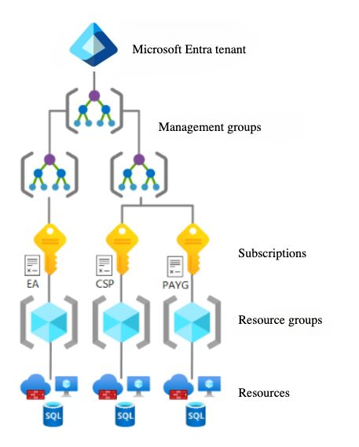

# ☁️ azure-104-notes

> 🧪 **Free AZ-104 Labs**: [Microsoft Learning AZ-104 Labs](https://microsoftlearning.github.io/AZ-104-MicrosoftAzureAdministrator/)

## 🏗️ Azure Concepts

> **Note**: Not everything in this section will appear on the AZ-104 exam. This is an overview of Azure services.

### VM Abstractions (Services Built on VMs)

- **Azure Batch**: Large-scale parallel and high-performance computing (HPC) workloads
- **Virtual Machine Scale Sets (VMSS)**: Auto-scale and load-balance sets of identical VMs
- **Azure Kubernetes Service (AKS)**: Managed Kubernetes clusters orchestrating containerized applications (runs on VM node pools)
- **Service Fabric**: Platform for running distributed, scalable microservices on a VM infrastructure
- **App Services**:
  - Fully managed platform for hosting **Web Apps**, **API Apps**, and **Container Apps**
  - No direct remote desktop access to server VMs (PaaS)
  - Supports multiple languages: **.NET**, **Java**, **Node.js**, **Python**, **PHP**, **Ruby**, **Docker containers**
  - Key benefits:
    - Built-in scaling (manual or automatic)
    - Continuous Integration (CI) support (Azure DevOps, GitHub, etc.)
    - Deployment slots for staged rollouts and testing
    - Easy integration with **Visual Studio**
    - SSL support, custom domains, authentication, and diagnostics

### 🌐 Azure Networking

#### Microservices

- **Azure Container Apps**: Serverless container platform, auto-scales
- **API Management (APIM)**: API gateway and lifecycle management
- **Azure Container Instances (ACI)**: Serverless containers, no infrastructure management
- **Service Fabric**: Distributed microservices platform

#### Serverless/Event-Driven

- **Azure Functions**: Serverless event-driven code execution
- **Azure Logic Apps**: Serverless workflow automation

Four major categories:

#### Connectivity

- **Virtual Network (VNet)**: Isolated network environment in Azure
- **Virtual WAN**: Unified hub-and-spoke network connectivity
- **ExpressRoute**: Private, dedicated connection between on-premises and Azure — operates over a private network, not the Internet
- **VPN Gateway**: Connects on-premises networks to Azure VNets (Site-to-Site or Point-to-Site)
- **Azure DNS**: DNS domain hosting and name resolution
- **Peering**: Connect VNets together

#### Security

- **Network Security Groups (NSGs)**: Firewall rules for subnet and NIC level traffic control (inbound and outbound rules)
- **Private Link**: Private connectivity to Azure services via Private Endpoints
- **DDoS Protection**: Protection against distributed denial-of-service attacks
- **Azure Firewall**: Managed network security service with application and network-level filtering
- **Web Application Firewall (WAF)**: Protection for web applications (part of Application Gateway/Front Door)
- **VNet Service Endpoints**: Extends VNet identity to Azure services over optimized route
- **Azure Bastion**: Secure RDP/SSH access to VMs without public IPs

#### Delivery

- **Azure CDN**: Content delivery network for global content distribution
- **Azure Front Door**: Global entry point with WAF, SSL termination, and routing
- **Traffic Manager**: DNS-based traffic distribution across regions
- **Application Gateway**: Layer 7 load balancer with SSL termination, WAF, and URL-based routing
- **Azure Load Balancer**: Layer 4 load balancer for TCP/UDP traffic distribution

#### Monitoring

- **Network Watcher**: Network monitoring and diagnostics tool
- **Metrics and Logs**: Network performance and diagnostic logging
- **Packet Capture**: Capture network traffic for analysis

## 🔗 Azure Virtual Network (VNet)

- Isolated private network for connecting Azure resources — most compute resources require a VNet
- Resources can communicate with each other, internet, and on-premises networks
- When creating a VM with a VNet: Azure assigns a **private IP** from the subnet, creates a **Network Interface (NIC)**, and optionally a **public IP**
- **Cost**: VNet itself is free

### Create VNet

- **Basics Tab**: Region matters — VNets only attach to compute resources in the **same region**
- **Security Tab**: Enable Bastion, Firewall, DDoS Network Protection, Virtual Network encryption (encrypt traffic within VNet)
- **IP Addresses Tab**: Define address space and subnets
  - If Bastion/Firewall enabled, Azure auto-creates their subnets
  - **Multiple subnets**: Separate tiers, isolate workloads, apply different NSGs

### Post-Creation

- **Settings → Subnets**: Add, remove, or modify subnets after VNet creation

### Public IP Address

- Separate Azure resource with **hourly cost** — search "Public IP address" in portal to create
- **Basics Tab**: Region, Availability Zone, Tier, Routing preference — should match the load balancer if associating with one
  - **DNS name label**: Optional custom DNS prefix
- **DDoS Protection Tab**:
  - **Network**: Inherits DDoS protection from associated VNet
  - **IP**: Dedicated DDoS protection for this IP
  - **Disable**: No DDoS protection
- **After creation**: Click **Associate** (top menu) to attach to a NIC or Load Balancer
  - Alternatively: Go to NIC → **Settings → IP configurations** → Click config → Associate public IP
- **Note**: Assigning a public IP doesn't automatically expose the VM — NSG rules may still block access

### Network Security Groups (NSGs)

- Act as firewalls for Azure resources — can be attached to **Network Interfaces (NIC)** or **Subnets**
- Define **Inbound rules** (traffic coming in) and **Outbound rules** (traffic going out)
- Rules specify: Priority, Source/Destination (IP, Service Tag, ASG), Port, Protocol, Action (Allow/Deny)
- **Priority**: Lower number = higher priority (evaluated first, range 100-4096)
- **Service Tags**: Predefined groups like `Internet`, `VirtualNetwork`, `AzureLoadBalancer` — use in Source/Destination instead of IPs
- **Best practice**: Minimize number of NSGs to reduce complexity

#### Default Inbound Rules

| Priority | Name                     | Port | Protocol | Source            | Destination    | Action |
| -------- | ------------------------ | ---- | -------- | ----------------- | -------------- | ------ |
| 65000    | AllowVnetInBound         | Any  | Any      | VirtualNetwork    | VirtualNetwork | Allow  |
| 65001    | AllowAzureLoadBalancerIn | Any  | Any      | AzureLoadBalancer | Any            | Allow  |
| 65500    | DenyAllInBound           | Any  | Any      | Any               | Any            | Deny   |

- By default, **all inbound traffic is denied** except from VNet resources and Azure Load Balancers

#### Default Outbound Rules

| Priority | Name                  | Port | Protocol | Source         | Destination    | Action |
| -------- | --------------------- | ---- | -------- | -------------- | -------------- | ------ |
| 65000    | AllowVnetOutBound     | Any  | Any      | VirtualNetwork | VirtualNetwork | Allow  |
| 65001    | AllowInternetOutBound | Any  | Any      | Any            | Internet       | Allow  |
| 65500    | DenyAllOutBound       | Any  | Any      | Any            | Any            | Deny   |

- By default, outbound traffic to VNet and Internet is allowed — add rules to restrict (e.g., block port 80 to `Internet` to deny non-HTTPS)

#### Effective Security Rules

- NSGs are **cumulative** — if NSG attached to both NIC and subnet, both apply
- Traffic must pass through **both** NSGs — a deny at either level blocks the traffic
- **Example**: Subnet NSG allows port 22, but NIC NSG denies port 22 → SSH is **blocked** (deny wins)
- **View both NSGs**: VM → **Networking → Network settings** — shows NIC NSG and subnet NSG
- **View effective rules**: NIC → **Help → Effective security rules** — shows combined rules from all NSGs affecting that NIC

#### Application Security Groups (ASGs)

- **ASG** = logical grouping of VMs/NICs — acts as an abstraction layer for NSG rules
- Instead of specifying individual private IPs in NSG rules, use an ASG as source/destination
- **Example**: Allow SSH only to specific VMs → create an ASG, add those VMs' NICs, set ASG as destination in NSG rule
- **Create ASG**: Search "Application Security Groups" → Create (name, region)
- **Add NICs to ASG**:
  - ASG → **Overview → Add** → select NICs, or
  - VM → **Networking → Network settings** → configure ASG on NIC

### Azure Firewall

- **To allow traffic to certain FQDNs**: Create Application Collection rules
- Managed network security service with application and network-level filtering

### Web Application Firewall (WAF)

- Provides centralized protection of web applications from common exploits and vulnerabilities
- Protects against SQL injection, cross-site scripting, and other common attacks
- Available on Azure Application Gateway and Azure Front Door

### VNet Peering

- By default, resources in different VNets **cannot communicate** with each other
- **Peering** connects two VNets, allowing resources to communicate as if on the same network
- **Requirements**: Subnet IP address ranges must **not overlap** between peered VNets
- **Hub-Spoke topology**: For complex networks, use a central "hub" VNet peered with multiple "spoke" VNets
- **Global peering**: Peering works across regions (e.g., Japan to US) — same setup process
- **Cost**: Data transfer between peered VNets has cost (inbound + outbound)
  - Same region: Lower cost
  - Cross-region (global peering): Significantly higher cost
  - Pricing: https://azure.microsoft.com/en-gb/pricing/details/virtual-network/

#### Creating a Peering

- Navigate to VNet → **Settings → Peerings** → **Add** (top menu)
- Select target VNet (or enter its **Resource ID for cross-subscription/tenant peering**)
- **Two-way configuration**: The screen has two sections — one for each direction:
  - **This VNet to remote VNet**: Configure access from this VNet to the peered VNet
  - **Remote VNet to this VNet**: Configure access from the peered VNet to this VNet
- **Peering options** (for each direction):
  - **Allow access**: Allow the peered VNet to access resources in this VNet
  - **Allow forwarded traffic**: Allow traffic forwarded from other networks (useful for Hub-Spoke with NVA/firewall)
  - **Allow gateway transit**: Share VPN/ExpressRoute gateway with peered VNet
- **After saving**: Azure creates a peering connection in **both** VNets (if both directions enabled)
- **Note**: NSG rules may still block traffic even after peering is established

### Route Tables (User-Defined Routes)

- **To route traffic via intrusion-based device**: Set up a route table and add it to the subnets in the other virtual networks

### VNet Gateway (VNet-to-VNet Connection)

- Alternative to peering for connecting VNets across regions — also used for Site-to-Site (S2S) and Point-to-Site (P2S) VPN
- **Cost advantage**: Gateway cost + **outbound traffic only** (no inbound cost) — can be cheaper than global peering if gateway already exists for VPN
  - Pricing: https://azure.microsoft.com/en-us/pricing/details/vpn-gateway/

#### Setup Steps

1. **Create Gateway Subnet** (in both VNets):
   - VNet → **Settings → Subnets** → **+ Gateway subnet**
   - Subnet name is always `GatewaySubnet` (fixed by Azure)
2. **Create VNet Gateway** (in both VNets):
   - Search "Virtual network gateway" → Create
   - Select the VNet and its `GatewaySubnet`
   - SKU affects cost and performance
3. **Create Connection** (in both gateways):
   - Gateway → **Settings → Connections** → **+ Add**
   - Connection type: VNet-to-VNet
   - Select the other gateway as target
   - **Shared Key (PSK)**: Must be **identical** on both sides
   - Connection establishes only when configured on **both** gateways

- **Cross-subscription**: VNet-to-VNet gateway connections between subscriptions require **PowerShell** (not available in portal)

### Name Resolution

- **DNS port**: DNS listens on port 53
- **BYO DNS (Bring Your Own)**: Use your own DNS server (on-premises or VM-hosted) — domain/subdomain resolution already handled before reaching Azure
- **Azure Private DNS**: Private DNS zones for name resolution within VNets — can define any zone name (even `microsoft.com`, but don't), not accessible from internet
- **Azure Public DNS**: Host public DNS zones for your domain — accessible from internet
- **Azure AD Domain Services**: Managed Active Directory domain services (LDAP, Kerberos, NTLM) without deploying domain controllers

#### Azure Private DNS

- **Use cases**: Inter-service communication, dev/test environments, internal APIs, microservices (e.g., `api.internal`, `db.dev.local`)
- **Create**: Search "Private DNS zones" → Create → Enter zone name (e.g., `mycompany.internal`, `dev.local`)
- **Link to VNet**: DNS zone → **DNS Management → Virtual network links** → **+ Add**
  - Select VNet to link
  - **Enable auto registration**: Automatically creates DNS records for new VMs in that VNet
  - **Note**: Auto registration is supported only for private DNS zones when linked to virtual networks, not public DNS zones
- **Manage records**: DNS zone → **DNS Management → Recordsets**
  - View all records (including auto-registered)
  - Add records manually: A, AAAA, CNAME, MX, TXT, etc. — same as public DNS
  - Records only accessible within linked VNets

#### Azure Public DNS (DNS Zone)

- Similar to Private DNS, but for public internet resolution
- **Create**: Search "DNS zones" → Create → Enter your domain name
- **After creation**: Copy the Azure name servers (NS records) → Add them to your domain registrar
- **Manage records**: DNS zone → **DNS Management → Recordsets**
  - Add A, AAAA, CNAME, MX, TXT records, etc.
  - **Important**: IP addresses must be **public IPs** (not private)

## ⚖️ Azure Load Balancers

| Service             | Layer   | Use Case                                              |
| ------------------- | ------- | ----------------------------------------------------- |
| Azure Load Balancer | Layer 4 | TCP/UDP traffic, internal or public load balancing    |
| Application Gateway | Layer 7 | HTTP/HTTPS, WAF, SSL termination, URL-based routing   |
| Azure Front Door    | Layer 7 | Global apps, CDN, WAF, SSL offloading, edge locations |
| Traffic Manager     | DNS     | DNS-based traffic direction, geographic routing       |

- **Azure Front Door**: Recommended for web-facing apps (CDN + load balancing + WAF), unless cost is primary concern

### Azure Load Balancer

- Layer 4 (Transport layer) load balancer for TCP/UDP traffic
- Distributes traffic across VMs in a backend pool
- **Types**: Can be **Internal** (private IP only) or **Public** (has public IP)
- **Region**: Keep load balancer in the same region or close to VMs for best performance

#### SKUs

| SKU      | Description                                                                                             |
| -------- | ------------------------------------------------------------------------------------------------------- |
| Basic    | **Deprecated** — not recommended, won't be correct answer on exam                                       |
| Standard | Recommended — SLA, NAT Gateway, Private Link, Availability Zone support, up to 10,000 backend instances |
| Gateway  | For third-party network virtual appliances (not covered in AZ-104)                                      |

- **Standard SKU backend types**: IP-based (on-prem, AWS, GCP servers) or NIC-based (Azure VMs, VMSS)

#### Availability Options

- **Zonal**: Load balancer in a single availability zone
- **Zone-redundant**: Microsoft distributes across multiple zones automatically
- **Tip**: When availability is the main priority, choose **zone-redundant** (multi-zone)

#### Availability SLA Comparison

- Single VM < 2+ VMs in Availability Set < VMs across Availability Zones (highest SLA)

#### Load Balancer Components

Three main components:

1. **Frontend IP configuration**: The public or private IP that receives traffic
2. **Backend pools**: Groups of VMs/servers that handle the traffic
3. **Rules**: Define how to route traffic from frontend to backend

#### Creating a Load Balancer

**Basics Tab:**

- **SKU**: Standard (recommended) or Gateway
- **Type**: Public (has public IP) or Internal (private IP only)
- **Tier**: Regional or Global (runs globally despite having a home region)

**Frontend IP configuration Tab:**

- Click **Add a frontend IP configuration** to define the public IP (for public type)

**Backend pools / Inbound rules / Outbound rules Tabs:**

- Can configure during creation or after — create the load balancer first and configure later

#### Post-Creation Configuration

- **Settings → Frontend IP configuration**: Manage frontend IPs
- **Settings → Backend pools**: Add/manage backend server groups
- **Settings → Load balancing rules**: Configure routing rules
- **Settings → Health probes**: Configure health checks for backend servers

**Adding Load Balancing Rules:**

- **Session persistence**: Keep client sessions on the same backend server
- **Outbound SNAT (Source NAT)**:
  - **Use outbound rules**: Provide backend pool members access to internet via explicit outbound rules
  - **Use default port allocation**: Provide backend pool members with default SNAT ports

#### Multiple Backend Pools

- Can have multiple backend pools with different server groups
- Use different rules to route traffic to different backends
- **Example**: Route `/api/*` to API servers pool, `/web/*` to web servers pool

#### Troubleshooting Load Balancer

Check the following areas when troubleshooting:

1. **Frontend IP configuration**: Verify public IP is correct, DNS name resolves properly
2. **Backend pools**: Check VM status (running), verify VMs are in correct pool, check health status
3. **Health probes**: Verify protocol (HTTP/HTTPS/TCP), port, path (e.g., `/health`), interval, and threshold settings
4. **Load balancing rules**: Verify frontend IP selected, frontend/backend ports match app, correct backend pool assigned, session persistence and idle timeout configured correctly
5. **Outbound rules**: Check when backend VMs can't reach the internet (SNAT port exhaustion, missing outbound rule)

#### Health Probe Alerts

- **Monitoring → Alerts**: Set up alerts to notify when health probes detect issues
- Use to get notified when backend servers become unhealthy

### Application Gateway

- Layer 7 (Application layer) load balancer for HTTP/HTTPS traffic
- Routes based on **URL path**, **headers**, **host**, and other HTTP attributes
- Supports WAF, SSL termination, and URL-based routing

#### Creating an Application Gateway

**Basics Tab:**

- **Enable autoscaling**: Scale instances based on traffic (set min/max instance count)
- **HTTP2**: Enabled at frontend, converts to HTTP/1.1 when routing to backend
- **VNet and Subnet**: Select VNet and a **dedicated subnet** (no other resources allowed in Application Gateway subnet)

**Frontends Tab / Backends Tab / Configuration Tab:**

- Similar to Azure Load Balancer (frontend IPs, backend pools, routing rules)

## 🔍 Network Watcher

- Azure automatically creates one Network Watcher **per subscription per region** you use
- Search "Network Watcher" to see all network watchers (don't go into individual ones — nothing specific there)

### Key Tools

- **IP Flow Verify**: Find out if a network security rule is preventing a network packet from reaching a virtual machine hosted in an Azure virtual network
- **Connection troubleshoot**: Troubleshoot connectivity between services (VMs) and external destinations
- **Connection monitor**: Track connectivity over time (latency, packet loss), alert on unstable or unreachable connections

### Connection Monitor

Track connectivity between sources and destinations with configurable test settings.

**Creating a Connection Monitor:**

1. **Add Test Group**:

   - **Sources**: VMs, VMSS, Azure Arc endpoints
   - **Destinations**: VMs, VMSS, external addresses (e.g., `google.com`)
   - **Test configuration**: Protocol, port (e.g., 443 for HTTPS), test frequency, path, success thresholds
   - **Disable test group**: Option to create the test group in disabled state

2. **Create Alert Tab**:
   - Define alerts for connection failures or threshold breaches

### Diagnostic Logs

- Most Azure resources have a diagnostics system that collects metrics and data
- **Disabled by default** for resources like NSGs, NICs
- For NIC, NSG, Public IP: Enable via Network Watcher → Logs → Diagnostic Logs, or via Monitor, or in each resource
- See [Azure Monitor](#-azure-monitor) section for full diagnostics workflow

## 📊 Azure Monitor

Centralised dashboard for metrics, logs, alerts, and diagnostics across all Azure resources.

- Can monitor **external servers** (on-prem, other clouds) by installing the appropriate agent
- Search "Monitor" in Azure Portal

### Insights Menu

| Insight              | Description                                                                                           |
| -------------------- | ----------------------------------------------------------------------------------------------------- |
| **Applications**     | For App Service web apps (Application Insights)                                                       |
| **Virtual Machines** | Requires agent installation to extract and send metrics                                               |
| **Storage Accounts** | Transaction timeline, E2E latency, server latency                                                     |
| **Containers**       | For Kubernetes containers                                                                             |
| **Networks**         | Traffic overview, connectivity checks, **Topology** (map of connections between servers and networks) |
| **Azure Cosmos DB**  | Access and visualize Azure SQL/Cosmos data                                                            |

### Diagnostic Settings

- Found in **Monitor → Settings → Diagnostic settings**
- Can also access via each resource's menu → **Diagnostic settings**
- **Note**: Some resources (VMs, Web Apps) won't appear in Monitor's list — configure from the resource itself

### Collecting Metrics & Logs

#### VM Diagnostics

- **Storage account requirement**: To get diagnostics from an Azure virtual machine, you need to create a storage account to store the diagnostic data

**Default Metrics (always collected):**

- Basic host-level: CPU utilisation, disk and network usage

**Guest-Level Monitoring (additional):**

1. Go to VM → **Monitoring → Diagnostic Settings**
2. Enable guest-level monitoring
3. Requires a **storage account** for storing guest-level logs
4. Configure log levels, performance counters, etc.

**Sending to Monitor Insights:**

- **Option 1**: VM → Monitoring → **Insights** → Configure
- **Option 2**: Monitor → Insights → **Virtual Machines** → Enable for the VM

#### App Service (Web App) Diagnostics

- Basic metrics collected by default (requests, response time, errors)
- For additional logs:

1. Go to Web App → **Diagnostic settings** → Add diagnostic setting
2. Check desired logs
3. Enable Application Insights: Web App → Monitoring → **Application Insights** → Turn on

⚠️ **Note**: Enabling some diagnostics may **reboot the resource**

### Viewing Metrics & Logs

#### Metrics

- Found in Monitor → **Metrics** (left menu)
- Select a **scope** (e.g., a VM) and apply
- View insights like CPU percentage, memory usage, etc.

#### Logs

- Found in Monitor → **Logs** (left menu)
- Scope can be as broad as an **entire subscription**
- **Note**: Logs have more delay than Metrics (can be over an hour)
- Uses **Kusto Query Language (KQL)** — similar to SQL
- **Pre-built queries**: Available in the queries hub for each resource type
  - Examples: "Get replication health status history", "Virtual Machine available memory"
  - Use them directly or learn KQL from their syntax

## 🔄 Backup & Recovery

### Backup

#### Creating a Backup Vault

- Enable backup from:
  - Resource itself (e.g., VM) → **Backup + Disaster Recovery → Backup**
  - Search "**Backup and Site Recovery**" in Azure Portal
- **Region**: Recovery Services vault and virtual machine must be in the same region (saves transfer costs)
- **Immutability**: Can enable at creation, disable or make irreversible later
- Created vault found under "**Recovery Services Vault**"

#### Configuring Backups

1. Go to Backup Vault → **Getting Started → Backup**
2. Choose workload (Azure VM, on-premise, etc.)
3. Select resource(s) to backup
4. Configure **Backup Policy**:
   - Frequency (daily, weekly)
   - Retention period
   - Instance restore snapshot retention

**Supported On-Premise Workloads:**

- Files and Folders (any Windows server, including AWS EC2)
- Hyper-V Virtual Machines
- VMware Virtual Machines
- Microsoft SQL Server, SharePoint, Exchange
- System State, Bare Metal Recovery

#### Managing Backups

- **View backups**: Vault → Protected Items → **Backup Items**
- **Backup now**: Click `...` (3 dots) at end of row → Backup now
- **View details**: See available restore points

#### Restoring

**Restore VM:**

1. Click **Restore VM** → Choose restore point
2. Options:
   - **New VM**: Can restore to different subscription (useful for copying VMs)
   - **Existing VM**: Replace current VM

**File Recovery:**

1. Click **File Recovery**
2. Download executable file (can add password protection)
3. Executable mounts a drive to your machine
4. Copy desired files
5. **Expires after 12 hours**

#### Monitoring & Diagnostics

- **Backup Jobs**: Vault → Monitoring → **Backup Jobs** (see ongoing backups)
- **Diagnostic Settings**: Vault → Monitoring → Diagnostic settings → Add
  - ⚠️ Create **separate** diagnostic settings for Backup and Site Recovery (data loss prevention)
- **Backup Reports**: Vault → Manage → **Backup reports**
  - Data shows up after backup jobs occur
  - Data is **up to yesterday** (no same-day data)

#### Soft Delete

- Deleted backups are **soft deleted** for **14 days**
- Can undelete within that window
- After 14 days, Azure permanently deletes automatically

### Site Recovery (ASR)

Azure Site Recovery (ASR) replicates workloads to a secondary region for disaster recovery.

#### Creating Site Recovery

- Go to VM → **Backup + Disaster Recovery → Disaster recovery**

**Basics Tab:**

- **Disaster recovery between availability zones?**: Only available if VM has zone availability enabled
- **Target region**: Choose closest region to the main resource

**Advanced Settings Tab:**

- VM resource group and VNet will be **new by default**
- **Availability options**: Single Instance, Availability Set, Availability Zone, VMSS
- Configure: Proximity placement, capacity reservation, storage settings, replication settings

#### Managing Replicated Items

- After creation, find vault in "**Recovery Services Vaults**"
- **Monitor progress**: Vault → Monitoring → **Site Recovery jobs**
- **View replicated items**: Vault → Protected Items → **Replicated Items**

#### Failover Options

| Action | Description |
|--------|-------------|
| **Failover** | Permanent failover — replication becomes standalone, no longer depends on source |
| **Test Failover** | Test that replication works without affecting production |

**Test Failover Workflow:**

1. Click **Test Failover** on the replicated item
2. Verify ASR VM is deployed in target region
3. Confirm everything works correctly
4. Return to replicated item → Click **Cleanup test failover**

## 📦 Azure Containers

Azure offers multiple ways to run containers:

- **App Service (Container)**: Deploy containers as web apps with App Service features
- **Azure Kubernetes Service (AKS)**: Managed Kubernetes for orchestrating containerized apps at scale
- **Azure Container Instances (ACI)**: Fastest way to run containers, no orchestration
- **Azure Container Apps**: Serverless containers with auto-scaling, built on Kubernetes

### Azure Container Registry (ACR)

- Private registry for storing container images (Docker, Helm charts, OCI artifacts)
- **Tiers**: Basic (limited), Standard (production), Premium (geo-replication, private endpoints, CMK)

**Publishing Images to ACR:**

- **Visual Studio**: Build → Publish Docker → Select Azure Container Registry
- **Docker CLI**:
  1. List registries: `az acr list --output table`
  2. Login to ACR (authenticates Docker): `az acr login --name <acr-name>`
  3. Tag image for ACR: `docker tag nginx <acr-name>.azurecr.io/nginx`
  4. Push to ACR: `docker push <acr-name>.azurecr.io/nginx`

### Container Instances (ACI)

- **What it is**: Fastest way to spin up containers in Azure, no VM management
- **Limitations**: No built-in scaling or orchestration — **to scale, create additional instances manually**
- **Use cases**: Quick tests, dev/sandbox environments, not production workloads

**Basics Tab:**

- **SKU**: Standard or Confidential (encrypted memory)
- **Image source**: Quickstart images, Azure Container Registry, or Other registry (Docker Hub, etc.)

**Networking Tab:**

- **Networking type**: Public, Private, or None
- **DNS name label**: Custom DNS prefix for public access
- **DNS name label scope reuse**: Control label uniqueness
- **Ports**: Define exposed container ports

**Advanced Tab:**

- **Restart policy**: Always, On failure, or Never
- **Environment variables**: Pass config to container at runtime

**Post-Creation (Settings → Containers):**

- View container status, state, and restart count
- **Events tab**: See container events (image pull, container start, etc.)

**Container Groups (CLI/PowerShell only):**

- Deploy multiple containers together (like Kubernetes sidecars) — **not available in Azure Portal**
- **Use case**: Main app container + logging/monitoring sidecar container
- **Deploy via CLI**:
  1. Create ARM template JSON file in Cloud Shell: `code container-group.json`
     - Template example: [Microsoft Docs - Multi-container group](https://learn.microsoft.com/en-us/azure/container-instances/container-instances-multi-container-group#configure-a-template)
  2. Deploy: `az deployment group create --resource-group <rg> --template-file container-group.json`
  3. View: `az container show --resource-group <rg> --name <container-group-name> --output table`
- After deployment, containers visible in ACI resource → **Settings → Containers**

### Container Apps

- Serverless container platform built on Kubernetes — less management than AKS, but less flexibility
- **Use cases**: Microservices, APIs, event-driven apps with auto-scaling

#### Create Container App

**Basics Tab:**

- **Container Apps Environment**: Create new or select existing
  - Zone redundancy, workload profiles, monitoring
  - Networking: Public access, use your own VNet, enable private endpoint

**Container Tab:**

- **Image source**: Quickstart image or custom image (ACR, Docker Hub)
- **Configuration**: Image name, tag, workload profile, GPU, environment variables

**Ingress Tab:**

- **Ingress traffic**: Limited to Container Apps environment or accept from anywhere
- **Ingress type**: HTTP or TCP
- **Session affinity**: Enable sticky sessions

#### Post-Creation

- **Networking → Ingress**: Modify ingress settings after creation
- **Application → Containers**: View containers, properties, env variables, health probes
- **Application → Revisions and replicas**: View revision history, create new revisions
- **Application → Scale**: Define min/max replicas for auto-scaling

## 🌐 Azure App Service

- **What it is**: Fully managed PaaS for hosting web apps, REST APIs, and mobile backends
- **Benefits**: No infrastructure management, built-in auto-scaling, CI/CD support, multi-language (.NET, Java, Node.js, Python, PHP)
- **App Service Plan**: Defines compute resources; multiple apps can share one plan
  - **Tiers**: Free, Shared, Basic, Standard, Premium, Isolated (higher tiers unlock auto-scale, deployment slots, VNet integration)
- **Deployment slots**: Staging environments to test before swapping to production (Standard+)

### Create Web App

**Basics Tab:**

- **Name**: Must be globally unique (becomes `<name>.azurewebsites.net`)
- **Publish type**:
  - **Code**: Deploy application code directly; select runtime stack (.NET, Java, Node.js, Python, PHP) and OS (Windows/Linux)
  - **Container**: Deploy Docker container image; select OS and container registry
  - **Static Web App**: For static HTML/CSS/JS sites with serverless APIs
- **Operating System**: Windows or Linux (depends on runtime stack)
- **Pricing plan**: Choose based on needs
  - Premium plans enable **Zone Redundancy** option for high availability across availability zones

**Database Tab:**

- **Create a database**: Check to provision a database with the web app
  - Configure database type and details (Azure SQL, MySQL, PostgreSQL, etc.)
- **Azure Cache for Redis**: Enable caching for improved performance (available when database creation is enabled)

**Deployment Tab:**

- **Continuous deployment**: Enable to auto-deploy on code changes
  - Connect to GitHub account, select organization, repository, and branch
  - Azure creates GitHub Actions workflow for CI/CD pipeline
- **Authentication settings**: Configure whether the web app requires authentication
  - **Enable**: Users must authenticate before accessing the app (integrates with Entra ID, social providers, etc.)
  - **Disable**: App is publicly accessible without authentication

**Networking Tab:**

- **Enable public access**: On/Off toggle for public internet accessibility
- **Enable virtual network integration**: Connect the web app to an Azure VNet for secure access to VNet resources (databases, VMs, private endpoints)

**Monitor + Secure Tab:**

- **Enable Application Insights**: Turn on application performance monitoring (APM) for diagnostics, logging, and telemetry
- **Enable Defender for App Service**: Microsoft Defender protection for threat detection and security recommendations

> **Cost Note**: App Service pricing is comparable to running a VM, but includes managed infrastructure, patching, scaling, and availability features.

### Post-Creation Configuration

**Deployment Center** (Settings → Deployment → Deployment Center):

- Configure deployment source after web app creation
- **Source options**: GitHub, Bitbucket, Azure Repos, Local Git, External Git, Containers, FTPS
  - VS Code uses FTPS protocol for deployments

**Deployment Slots** (Deployment → Deployment slots):

- Create separate environments (staging, QA) for zero-downtime deployments
- **Use cases**: Staging/testing, A/B testing, blue/green deployments, quick rollback
- **Swap**: Deploy to staging → Test → Click **Swap** to switch with production
- **Traffic %**: Distribute traffic between slots for gradual rollouts (canary deployments)

**Environment Variables** (Settings → Environment variables):

- **App settings**: Define app settings (e.g., `API_KEY`) accessible as environment variables
- **Connection strings**: Add database/cache connection strings
- When adding either, **Deployment slot setting** checkbox keeps the value with the slot during swap

**Configuration** (Settings → Configuration):

- **General settings**: HTTP version, Web sockets, Always On, Session affinity (ARR), Min TLS version
- **Stack settings**: Runtime stack (.NET, Java, Node.js, Python) and version
- **Default documents**: Pages served when no file specified in URL (e.g., `index.html`, `default.aspx`)
- **Path mappings**: Map URL paths to virtual directories or mount Azure Storage as directories

**Scaling** (App Service Plan menu):

- **Scale Up** (vertical): Change server size/tier (switch between Hardware and Features tabs on top)
- **Scale Out** (horizontal): Increase/decrease number of instances (max depends on plan tier)
  - **Manual**: Set fixed instance count
  - **Automatic**: Define max burst and always-ready instances
  - **Rules based**: Scale on metrics like CPU, memory (similar to VMSS)
  - Some options may be disabled for lower-tier plans

**Backups** (Settings → Backups):

- **Automatic backups**: Every hour, up to 30 days retention, max 30 GB (excludes databases)
- **Custom backups**: Click **Configure** (top menu) to store backups in Azure Storage
  - **Advanced tab**: Option to include database backups

**Networking** (Settings → Networking):

- **Inbound traffic**:
  - **Public network access**: Enable for all networks (no restriction), selected VNets/IPs, or disable
    - Advanced filtering: CIDR blocks, headers, X-Forwarded-For, Azure-FDID
  - **Inbound addresses**: IPs clients use to reach your app (whitelist in external firewalls/services)
  - **App assigned address**: Set custom domain (also in Settings → Custom domains)
- **Outbound traffic**:
  - **VNet integration**: Connect app to a VNet to access private resources (VMs, databases)
    - For VNets in other regions, requires site-to-site VPN
  - **Outbound addresses**: IPs your app uses for outbound calls (whitelist in destination services/databases)

**Custom Domains** (Settings → Custom domains):

- **Methods to add custom domain**:
  1. **Via Azure DNS Zone**: DNS zone → Recordsets → Add CNAME pointing to `<app-name>.azurewebsites.net`
  2. **Via App Service** (other registrars): Add custom domain → Domain provider: "All other domain services" → Follow suggested approach (A record + TXT, or CNAME)
  3. **Via App Service Domain**: Add custom domain → Domain provider: "App Service Domain" (requires purchasing domain first via **Buy App Service domain** on Custom domains page)
- **SSL/TLS binding**: After adding domain, click **Add Binding** → Select certificate → Choose TLS/SSL type:
  - **SNI SSL**: Multiple SSL sites share same IP (modern browsers, most common)
  - **IP-based SSL**: Dedicated IP per SSL certificate (legacy clients, higher cost)

**Certificates** (Settings → Certificates): Managed (free, auto-renewed), Bring your own (.pfx), or Public key (.cer)

## 🖥️ Azure Virtual Machines (VMs)

### VM Creation

**CLI/PowerShell:**

- **Azure CLI**: `az vm create -n <vm-name> -g <resource-group> --image <image-name>`
- **PowerShell**: `New-AzVM -Name <vm-name> -Credential (Get-Credential)`
- **PowerShell script**: Upload and run shell scripts for automated provisioning

**Basics Tab:**

- **Availability options**:
  - **No infrastructure redundancy required**: Single VM, no high availability
  - **Availability zone**: Deploy VM in specific zone within region (protects against datacenter failures)
  - **Virtual machine scale set**: Auto-scaling group of identical VMs with load balancing
  - **Availability set**: Group VMs across fault domains and update domains within single datacenter (99.95% SLA)
    - **Limitation**: Availability sets cannot protect VMs from data center-level failure — use Availability zones for data center failure protection
- **Security type**:
  - **Standard**: Regular VM without additional security features
  - **Trusted launch**: Secure boot, vTPM (virtual Trusted Platform Module), integrity monitoring (protects against boot kits and rootkits)
  - **Confidential**: Encrypted in-memory processing for sensitive workloads (requires specific VM sizes)
- **Run with Azure Spot discount**:
  - Uses Azure's excess capacity at significant discount (up to 90% off)
  - VMs can be evicted when Azure needs capacity back
  - **Eviction type**:
    - **Capacity only**: Evict only when Azure needs capacity
    - **Price or capacity**: Evict when capacity needed or when price exceeds your max price
  - **Eviction policy**: Deallocate (stop) or Delete
  - **Use cases**: Batch processing, dev/test environments, interruptible workloads
  - **Not suitable for**: Production workloads requiring high availability

**Disks Tab:**

- **OS disk type**: Premium SSD, Standard SSD, Standard HDD
- **Encryption at host**: Encrypts data at rest on VM host (double encryption with platform key)
  - **Enable feature**: Run `Register-AzProviderFeature -FeatureName "EncryptionAtHost" -ProviderNamespace "Microsoft.Compute"` first
- **Delete with VM**: Auto-delete disk when VM deleted
- **Key management**: Platform-managed key (PMK) or Customer-managed key (CMK)
  - **CMK setup**: Select a **Disk Encryption Set** (must be in same region as VM)
  - **Prerequisites for CMK** (create in this order):
    1. **Key Vault**: Create with purge protection enabled (**Settings** → **Properties** → **Enable purge protection**)
       - Set **Days to retain deleted vaults** as needed
       - **Access configuration**: Enable checkboxes to allow services to access keys:
         - **Azure VMs for deployment**: VMs can retrieve certificates/keys
         - **Azure Resource Manager for template deployment**: ARM can access keys during deployments
         - **Azure Disk Encryption for volume encryption**: Required for disk encryption with CMK
    2. **Key**: Key Vault → **Objects** → **Keys** → **Generate/Import** (requires Key Vault Administrator role)
    3. **Disk Encryption Set**: Create with encryption type "...with a customer-managed key", select Key Vault and Key
       - If alert appears ("To associate a disk, image..."), click to resolve
  - **Enable encryption on existing VM**: VM → **Settings** → **Disks** (shows current encryption status per disk)
    - Click **Additional settings** (top menu) → Select **Disks to encrypt** (None, OS disk, OS and data disks)
    - Choose Key Vault and Key (if no Key selected, new one created automatically)
    - Key Vault only needs **Azure Disk Encryption for volume encryption** checkbox enabled
    - VM restart required to apply encryption
- **Azure Disk Encryption (ADE)**:
  - **Windows VMs**: Uses BitLocker for VM-controlled disks
  - **Linux VMs**: Uses dm-crypt for VM-controlled disks
  - **Backup**: ADE encrypted VMs can be backed up to Recovery Services Vault
  - **Integration**: ADE is integrated with Azure Key Vault
- **Enable Ultra Disk compatibility**: Allows attaching Ultra Disks for highest performance
- **Data disks**: Attach additional disks for data storage (number limited by VM size/type)

**Networking Tab:**

- **Virtual network**: Select existing VNet or create new (required - every VM must be in a VNet)
  - **Address space**: IP range for entire VNet (e.g., 10.0.0.0/16 provides 65,536 IPs)
  - **Subnet**: Subdivision of VNet for organizing resources (e.g., 10.0.1.0/24 provides 256 IPs)
- **NIC network security group**: Network interface-level firewall
  - **None**: No NSG attached
  - **Basic**: Auto-created NSG with simple inbound port rules (This option is enough for most cases)
  - **Advanced**: Attach existing NSG with custom rules
- **Public inbound ports**: Allow selected ports (SSH 22, RDP 3389, HTTP 80, HTTPS 443) or None
- **Delete public IP and NIC when VM is deleted**: Auto-delete networking resources with VM
- **Enable accelerated networking**: SR-IOV bypasses host for direct VM-to-network communication
  - **Use cases**: High-performance workloads, low-latency applications, high packet-per-second scenarios
  - Requires supported VM size
- **Load balancing options**:
  - **Azure load balancer**: Layer 4 (TCP/UDP) load balancer, like AWS NLB
  - **Application Gateway**: Layer 7 (HTTP/HTTPS) load balancer, like AWS ALB

**Management Tab:**

- **Enable system assigned managed identity**: Enable if VM needs to access other Azure services (Storage, Key Vault, databases) without storing credentials
- **Login with Microsoft Entra ID**: Allow users to login using Entra ID credentials
- **Enable auto-shutdown**: Schedule automatic VM shutdown for cost savings
- **Enable backup**: Configure Azure Backup for VM protection
- **Enable periodic assessment**: Regular security and health assessments
- **Enable hotpatch**: Apply security patches without rebooting (Windows Server only)
- **Patch orchestration options**: Control how OS patches are applied (manual, automatic, Azure-orchestrated)
- **Reboot setting**: Control VM behavior after patching (if required, never, always)

**Monitoring Tab:**

- **Enable recommended alert rules**: Auto-configure common alerts (CPU, memory, disk) - costs per alert
- **Boot diagnostics**: Capture boot logs and screenshots (disable is okay for most cases)
- **Enable guest diagnostics**: Collect detailed performance metrics from inside VM
- **Enable application health monitoring**: Monitor application-level health status

**Advanced Tab:**

- **Extensions**: Install VM extensions for additional functionality (antivirus, monitoring agents, etc.)
- **VM Applications**: Pre-package needed applications to deploy automatically during VM creation
- **Custom data**: Pass startup scripts or configuration data to VM
- **User data**: Similar to custom data, but retrievable from within VM after creation
- **Performance (NVMe)**: Enable NVMe storage for highest disk performance
- **Host group**: Place VM on dedicated physical host
- **Capacity reservations**: Reserve compute capacity in advance (beneficial when guaranteed capacity is needed for critical workloads or during high-demand periods)
- **Proximity placement group**: Group VMs for low latency by placing them physically close

### 🔗 Connecting to VMs

- **Connection options**: VM → **Connect** → Choose method (RDP, SSH, Bastion, Serial console)
- **RDP (Windows)**: Port 3389, download `.rdp` file → Open with Remote Desktop client
- **SSH (Linux)**: Port 22, use `ssh -i <key-path> <user>@<public-ip>` or password auth
- **Serial Console**: Text-based access for troubleshooting unresponsive VMs (requires boot diagnostics)
- **Reset access**: VM → **Help** → **Reset password** (if locked out)
- **Troubleshoot connections**: VM → **Help** → **Connection troubleshoot** — test connectivity to another VM, IP, or URL

### 🏰 Azure Bastion

- **Purpose**: Secure browser-based RDP/SSH to VMs without public IPs, no NSG rules needed, protects against port scanning
- **Creation settings**:
  - **Availability zone**: Select zone for redundancy (or none)
  - **Tier**: Developer, Basic, Standard, Premium
  - **Instance count**: Number of scale units (Standard/Premium only)
  - **Virtual network**: Must be in the same VNet as target VMs
  - **Subnet**: Requires dedicated subnet named `AzureBastionSubnet` (minimum /26)
- **Connect via Bastion**: VM → **Connect** → **Bastion** → Enter credentials → **Connect**

### 💾 Adding Data Disks

- **Location**: VM → **Settings** → **Disks** → **+ Create and attach a new disk** or **Attach existing disks**
- **Disk types**: Premium SSD (fastest), Standard SSD, Standard HDD, Ultra Disk (highest IOPS)
- **vs Temporary disk**: Data disks persist across reboots/deallocations; temporary disk (D: drive) is lost on deallocation
- **After attaching**: Must initialize and format disk inside VM (Windows: Disk Management, Linux: `fdisk`/`mkfs`)
- **Max disks**: Limited by VM size (check VM specs for maximum data disk count)
- **Detach**: Can detach and reattach to different VMs (same region)

### 🔌 Attaching Network Interfaces

- **Requirement**: VM must be stopped (deallocated) before attaching a Network Interface

### 📈 Virtual Machine Scale Sets (VMSS)

- **Purpose**: Auto-scaling group of identical VMs with built-in load balancing and availability zone support

#### VMSS Creation

Most settings similar to regular VM creation.

**Basics Tab:**

- **Orchestration mode**:
  - **Flexible**: Mix VM sizes, more control but requires manual configuration
  - **Uniform**: Identical VMs optimized for large-scale workloads
- **Scaling mode**:
  - **Manual**: Set fixed instance count
  - **Autoscaling**: Scale based on metrics (CPU, memory, schedule)
  - **No scaling profile**: Create empty scale set
- **Instance count**: Initial number of VMs, minimum 2 for high availability

**Spot Tab:**

- **Spot VMs**: Use Azure's excess capacity at discounted prices (up to 90% off), can be evicted anytime
- **Eviction type**:
  - **Capacity only**: Evict when Azure needs capacity
  - **Price or capacity**: Evict when capacity needed or price exceeds max
- **Eviction policy**: Stop/Deallocate or Delete
- **Try to restore instances**: Attempt to recreate evicted Spot VMs when capacity available

**Disks Tab:** Similar to VM (OS disk type, encryption, data disks)

**Networking Tab:** Similar to VM (VNet, subnet, NSG, load balancing)

**Management Tab:** Similar to VM, plus:

- **Enable standby pools**: Pre-provisioned instances ready to scale quickly
- **Enable overprovisioning**: Create extra VMs during scaling, delete extras after success (faster scaling)

**Health Tab:**

- **Enable application health monitoring**: Monitor app health via extension or load balancer probes
- **Resilient VM create/delete**: Retry failed operations automatically
- **Automatic instance repairs**: Replace unhealthy instances automatically
- **Repair actions**: Reimage, Restart, or Replace (when health monitoring enabled)
- **Grace period**: Wait time before monitoring starts (allow app to initialize)

**Advanced Tab:** Similar to VM (extensions, custom data, proximity placement groups)

#### Managing VMSS

- **Instances**: View all VM instances, their status, and details (VMSS → **Instances** in left menu)
- **Scaling**: VMSS → **Availability + scale** → **Scaling** (manual scaling or configure autoscaling)
  - **Autoscaling**: Define rules based on metrics (e.g., scale up if CPU > X%, scale down if memory < Y%), set min/max/default instance counts
- **CLI manual scaling**: `az vmss scale --new-capacity <count> --name <vmss-name> --resource-group <rg-name>`

## 📦 Azure Storage

- Scalable from GBs to PBs (petabytes) for massive growth needs
- Storage types:
  - **Blob Storage**: Stores unstructured data (objects, files, images, backups)
  - **Azure Files**: Managed file shares (SMB/NFS protocol)
  - **Managed Disks**: Persistent storage for Azure VMs
  - **Table Storage**: NoSQL key-value storage
  - **Queue Storage**: Message queuing for distributed apps
- Available as **local** (regionally-redundant) or **global** (geo-redundant/global endpoints) storage
- Storage tiers for Blobs:
  - **Hot**: Frequent access, higher cost
  - **Cool**: Infrequent access, cheaper for storage
  - **Archive**: Rarely accessed, lowest cost, high retrieval time
- Managed vs. Unmanaged Disks:
  - **Managed Disks**: Azure handles storage accounts, high scalability/reliability, easier to manage
  - **Unmanaged Disks**: User manages storage accounts, legacy usage only
- **Pricing comparison**: https://azure.microsoft.com/en-us/pricing/details/storage/blobs/

#### Storage Account Creation Considerations

- **Storage account name**: Must be globally unique across all of Azure (3-24 characters, lowercase letters and numbers only)
- **Region selection**: Consider three factors:
  - Distance from users (lower latency)
  - Region-limited features (not all features available in all regions)
  - Cost (pricing varies by region)
- **Performance tiers**:
  - **Standard**: Lower storage cost, higher transaction/operation cost
  - **Premium**: Higher storage cost, lower read operation cost (better for high-transaction workloads)
- **Redundancy options** (some regions may not support all options):
  - **LRS (Locally Redundant Storage)**: 3 copies within single data center (Microsoft maintains 2 additional copies as disks fail over time)
  - **ZRS (Zone-Redundant Storage)**: 3 copies across availability zones within a region
  - **GRS (Geo-Redundant Storage)**: 6 copies across 2 regions (3 in primary, 3 in secondary)
    - **"Make read access to data available in the event of regional unavailability"**: Enables RA-GRS (slightly higher cost)
    - **"Geo priority replication guarantees Blob storage data is geo-replicated within 15 minutes"**
  - **GZRS (Geo-Zone-Redundant Storage)**: Safest option, combines ZRS and GRS

#### Storage Account Types and Archive Tier Support

- **General Purpose V2**: Supports all Azure Storage tiers (Hot, Cool, Archive) — can store objects in Archive tier
- **General Purpose V1**: Does NOT support Archive tier — designed for general-purpose storage only
- **Blob Storage accounts**: Blob Storage is a storage service inside the account, not a storage account type itself — not applicable for Archive tier storage account selection

**Advanced Tab Settings:**

- **Security**:
  - **"Require secure transfer for REST API operations"**: Disables HTTP access, allows only HTTPS
  - **"Allow enabling anonymous access on individual containers"**: Check only when files need to be publicly accessible (e.g., website assets like videos, JS, CSS files)
  - **"Enable storage account key access"**: Allows key-based authentication (disable to enforce Entra ID only)
  - **"Default to Microsoft Entra Authentication in the Azure portal"**: Uses Entra ID (RBAC) instead of storage keys
- **Blob storage access tiers** (default tier for new blobs, can be set per file):
  - **Hot**: Frequent access, optimized for data accessed regularly, higher storage cost, lower access cost
  - **Cool**: Infrequent access (30+ days retention), lower storage cost, higher access cost
  - **Cold**: Rarely accessed (90+ days retention), even lower storage cost, even higher access cost

**Networking Tab Settings:**

- **Network access**:
  - **Enable**: Public access enabled (access key still required)
    - **Enable for all networks**: Accessible from internet
    - **Enable for selected virtual networks and IP addresses**: Restrict to specific VNets and IP ranges (use case: corporate network or specific Azure resources)
  - **Disable**: No public access, requires private endpoints
  - **Secured by Perimeter** (Most restricted): Strictest security, only accessible through configured security perimeter
- **Routing preference**:
  - **Microsoft network routing**: Traffic through Microsoft's global network (better performance, slightly higher cost)
  - **Internet routing**: Traffic through public internet (lower cost, may have higher latency)

**Data Protection Tab Settings:**

- **Recovery** (prevent accidental or malicious data loss):
  - **Enable point-in-time restore for containers**: Restore blob data to earlier state within retention period (requires versioning, change feed, and blob soft delete enabled)
  - **Enable soft delete for blobs**: Retain deleted blobs for specified days (can recover within retention period)
    - **Purpose**: Protects against accidental deletion — keeps deleted files for 14 days (default) before permanent deletion
  - **Enable soft delete for containers**: Retain deleted containers for specified days
  - **Enable soft delete for file shares**: Retain deleted file shares for specified days
- **Tracking**:
  - **Enable versioning for blobs**: Maintains previous versions of blobs when modified or deleted
  - **Enable blob change feed**: Logs all changes to blobs (creates, modifications, deletions) for auditing and compliance
- **Access control**:
  - **Enable version-level immutability support**: Prevents files from deletion or modification (WORM - Write Once Read Many). Use case: Store access logs that cannot be deleted, even if hacker gains access and attempts to erase their activity traces

**Encryption Tab Settings:**

- **Encryption types**:
  - **MMK (Microsoft-Managed Keys)**: Default option, Microsoft manages and rotates encryption keys automatically
  - **CMK (Customer-Managed Keys)**: Customer controls encryption keys for greater security and compliance
- **Enable support for customer-managed keys** (available regardless of encryption type):
  - Scope options:
    - Blobs and files only
    - All service types (blobs, files, tables, and queues)
  - **Encryption key** source:
    - From URI: Specify key URI directly
    - From Key Vault: Select key from Azure Key Vault
- **Enhanced security**:
  - **Enable infrastructure encryption**: Adds second layer of encryption at infrastructure level (double encryption for highly sensitive data)

**Review + Create:**

- Review all configuration settings across all tabs
- Azure validates the configuration (checks policies, naming, quotas)
- Click **Create** to deploy the storage account

#### Blob Containers and Management

- **Containers**: Organize blobs within storage account (like folders/boxes to put blobs in)
- **Blob types**:
  - **Block blobs**: Designed to store large amounts of unstructured data (images, backups, thousands of image files)
  - **Append blobs**: Used for log data where the need is to continuously append new data
  - **Page blobs**: Typically used for storing virtual hard disks (VHDs) for Azure virtual machines
- **Blob access tiers**: Can be set during file upload or changed later from top menu:
  - **Hot**: Frequent access
  - **Cool**: Infrequent access (30+ days)
  - **Cold**: Rarely accessed (90+ days)
  - **Archive**: Long-term archival storage, lowest cost, but data must be rehydrated before access (not available as default during storage account creation)

#### Lifecycle Management

- **What it is**: Automated policy-based data management to transition blobs between tiers or delete them
- **Location**: Storage account → **Data management** → **Lifecycle management**
- **Benefits**: Great for saving huge money on storage costs by automatically managing data lifecycle
- **Rule configuration** (first tab):
  - **Rule Scope**:
    - **Apply rule to all blobs**: Applies to entire storage account
    - **Limit blobs with filters**: Opens **Filter set** tab for additional filtering
  - **Blob type**: Block blobs or Append blobs
  - **Blob subtype**: Base blobs, Snapshots, or Versions
- **Filter set** tab (when "Limit blobs with filters" is selected):
  - **Blob prefix**: Apply to specific blob name patterns (e.g., "logs/")
    - **Format**: `[container name]/[blob name]` — path must begin with container name
    - **Container-level match**: `container1/` (with trailing slash) matches all blobs in `container1`
    - **Container name prefix**: `container1` (no trailing slash) matches all containers starting with `container1`
    - **Sub-path match**: `container1/sub1/` matches blobs in `container1` starting with `sub1/`
    - **Wildcards**: `*` and `?` are literal characters (not wildcards) in blob prefix matching
    - **Case-sensitive**: Prefix matching is case-sensitive
  - **Blob index match**: Filter by blob index tags
- **Rule actions** (can define multiple actions in sequence):
  - **Move to cool tier**: After X days since creation/last modification/last access
  - **Move to cold tier**: After X days since creation/last modification/last access
  - **Move to archive tier**: After X days since creation/last modification/last access
  - **Delete blobs**: After X days since creation/last modification/last access
- **Minimum retention requirements** (charged for minimum period even if moved/deleted earlier):
  - **Cool tier**: Minimum 30 days
  - **Cold tier**: Minimum 90 days
  - **Archive tier**: Minimum 180 days

#### Object Replication

- Feature of Azure Blob Storage that works at the container level
- Asynchronously copies block blobs between source and destination storage accounts
- **Supported storage account types**: General Purpose V2 (StorageV2) and Premium Block Blob Storage (BlobStorage)
- **Configuration**: Must configure object replication policies between source and destination containers
- **Use cases**: Disaster recovery, minimize latency, compliance
- **Requirements**: Blob versioning must be enabled on both accounts
- **Location**: Storage account → **Data management** → **Object replication**

#### AzCopy

- Command-line utility for copying data to/from Azure Storage
- **Use cases**:
  - Copy from local machine to storage account
  - Copy between storage accounts
  - Copy between containers
  - Sync directories
- **Authentication methods**:
  - **Entra ID (Microsoft Entra)**: `azcopy login` (recommended for interactive use)
  - **SAS token**: Append SAS token to destination URL
  - **Access key**: Via connection string or storage account key
- **Common commands**:
  - `azcopy copy <source> <destination>`: Copy files
  - `azcopy sync <source> <destination>`: Sync directories (one-way)
  - `azcopy remove <target>`: Delete blobs
- **Benefits**: Fast, resumable transfers with parallelism and automatic retries

#### Azure Import/Export Service

- Allows data transfer into **Azure Blobs** and **Azure Files** by creating jobs

#### Storage Browser

- Azure Portal GUI tool for managing storage files across multiple accounts
- **Features**: Upload, download, copy, paste, delete operations with graphical interface
- **Location**: Search "Storage browser" in Azure Portal

#### Azure File Share

- Fully managed cloud file shares accessible via SMB and NFS protocols
- **Use cases**: Shared application files, configuration files, lift-and-shift scenarios
- **Access**: Mount as network drive on Windows/Linux/macOS (SMB requires port 445 open)
- **Location**: Storage account → **Data storage** → **File shares** (also accessible via Storage browser)
- **Snapshots**: Manual one-time copy of files, browse/restore individual files (File share → **Operations** → **Snapshots**, or Windows "Previous Versions" tab)
- **Backup**: Scheduled/frequent backup with configurable policies and retention (File share → **Operations** → **Backup**)

#### Azure File Sync (Synchronize with On-Premise Server)

- **To synchronize files between Azure File Share and on-premise server**:
  - **Create a sync group**: Essential for managing synchronization between file share and on-premise server
  - **Register a server name**: Establishes connection between on-premise server and Azure services for file synchronization
  - **Install Azure File Sync agent**: Enables synchronization and facilitates file transfer between file share and on-premise server

#### Storage Authentication Methods

- **Token-Based Access (Access Keys)**:
  - Access uses storage account keys (tokens)
  - View keys: Storage account → **Security + Networking** → **Access Keys**
  - Keys must be shared with applications or users who need access
  - Less granular control compared to RBAC
- **Role-Based Access (RBAC)**:
  - Access through Azure Entra ID roles (IAM)
  - Provides granular access control through Azure roles
  - Recommended for better security and access management
- **Default to Microsoft Entra Auth in Azure Portal**: Controls which method the Azure Portal uses by default when you access storage (doesn't disable either method)

#### Storage Access Keys

- **Two access keys** (key1 and key2) provide full access to storage account and all data
- **Why two keys**: Enables key rotation without downtime
  - Applications use key1 → Regenerate key2 → Switch apps to key2 → Regenerate key1
- **Location**: Storage account → **Security + Networking** → **Access Keys**
- **Security**: Access keys are like root passwords - store securely (Azure Key Vault), rotate regularly

#### Shared Access Signature (SAS)

- URI token granting restricted access to storage resources
- **Benefits**: Granular control (specific resources, permissions, time period) vs full access with keys
- **SAS Types**:
  - **User Delegation SAS**: Secured with Entra ID (most secure)
  - **Service SAS**: Access to specific service (Blob, Queue, Table, File)
  - **Account SAS**: Access to multiple services
- **Creating SAS**:
  - **Container level**: Container → **Shared access tokens**
  - **Blob level**: Open blob → **Generate SAS** (from top menu or right-click context menu)
  - **Storage account level**: Storage account → **Shared access signature**
- **SAS Configuration Parameters**:
  - **Signing key**: Choose which access key to use (key1 or key2)
  - **Permissions**: Read, Write, Delete, List, Add, Create, Update, Process (select only needed)
  - **Start date/time**: When SAS becomes valid
  - **Expiry date/time**: When SAS expires
  - **Allowed IP addresses**: Restrict to specific IP ranges
  - **Allowed protocols**: HTTPS only (recommended) or HTTP and HTTPS
  - **Stored access policy**: Reference to predefined access policy (optional)
- **Stored Access Policy**:
  - Created at container level: Container → **Settings** → **Access policy** → **Add policy**
  - Define permissions, start/expiry times centrally in the policy
  - When generating SAS, select the stored access policy instead of defining parameters directly
  - **Benefits**: Centralized management - modify or revoke permissions for all SAS tokens using that policy without regenerating access keys
  - **Revoking**: Delete or modify the stored access policy to immediately affect all associated SAS tokens
- **Revoking SAS without Stored Access Policy**: Cannot revoke individual SAS tokens - only way is regenerating the access key used to create it (revokes all SAS tokens created with that key)
- **Best practices**: Use stored access policies for easier management, shortest expiry time, minimum permissions, HTTPS-only, prefer User Delegation SAS

#### Controlling Storage Access Methods

- **"Default to Microsoft Entra Auth in Azure Portal"**: Storage account → **Settings** → **Configurations**
  - When enabled: Azure Portal defaults to using Entra ID (RBAC) authentication
  - When disabled: Azure Portal defaults to using access keys
  - Note: This only controls the default method in the portal; both methods remain available
- **"Allow Storage account key access"**: Storage account → **Settings** → **Configurations**
  - When disabled: Completely blocks access key authentication (enforces Entra ID only)
  - Best practice: Disable if you want to enforce RBAC-only access

#### Storage RBAC - Resource Permissions vs Data Permissions

- **Resource permissions**: Control management operations on the storage account (create, delete, modify settings, assign roles)
  - Examples: Owner, Contributor, Reader roles
  - Owner can manage everything but cannot read/write data by default
  - Contributor can manage resources but cannot assign roles
  - Reader can only view resource properties
- **Data permissions**: Control access to data within storage (blobs, queues, tables, files)
  - Examples: Storage Blob Data Owner, Storage Blob Data Contributor, Storage Blob Data Reader
  - Separate from resource permissions
  - Required to read/write data even if you have Owner role on the resource
- **View your access**: Storage account → **IAM** → **View my access** button to see current permissions

#### Storage Roles

- **Resource management roles**:
  - **Owner**: Full management access (manage everything, assign roles)
  - **Contributor**: Manage resources but cannot assign roles
  - **Reader**: Read-only access to resource properties
- **Data access roles** (Storage-specific):
  - **Storage Blob Data Owner**: Full access to blob containers and data (read, write, delete, manage)
  - **Storage Blob Data Contributor**: Read, write, and delete blob data
  - **Storage Blob Data Reader**: Read-only access to blob data
  - Similar roles exist for Queues, Tables, and Files (e.g., Storage Queue Data Contributor)
- **Role descriptions**: Check role descriptions in **IAM** → **Roles** tab to understand access levels

#### Assigning Storage Roles

- **Method 1**: Storage account → **IAM** → **Roles** tab → Select role checkbox → Click **Add role assignment** → Assign to user/group
- **Method 2**: Storage account → **IAM** → **Add role assignment** button → Select role → Assign to user/group/service principal
- **Scope inheritance**: Roles assigned at storage account level apply to all containers, queues, and tables within that account
- **Resource group level**: Assign roles at resource group level for environment-specific access (e.g., separate prod/dev resource groups)
- **Permission combination**: Role assignments are cumulative across scopes (union of all permissions)

#### Container-Level Role Assignment

- **Container-specific permissions**: Open container → **IAM** (left menu) → Assign roles from this screen
- **Scope**: Role assignments at container level affect only that specific container, not all containers in the storage account
- **Inheritance**: Storage-level role assignments are inherited by all containers, but container-level assignments override for that specific container
- **Access method switch**: When viewing container data (**Data Storage** → container), toggle switch at top of page to switch between:
  - **Access key**: Uses storage account keys (token-based)
  - **IAM role**: Uses assigned RBAC roles

### 🗄️ Azure Data Services

- **SQL Services**:
  - **Azure SQL Database**: Managed relational database (PaaS), serverless and provisioned tiers
  - **Azure SQL Managed Instance**: Near 100% compatibility with SQL Server, VNet integration
  - **SQL Server on Azure VMs**: IaaS option for full SQL Server control
  - **Backup**: Azure SQL Server has automatic daily backups — no need to set up additional Azure Backup policy
- **NoSQL Services**:
  - **Azure Cosmos DB**: Globally distributed, multi-model NoSQL database
  - **Azure Table Storage**: NoSQL key-value store (part of Azure Storage)
- **Azure Database for PostgreSQL Flexible Server**: Managed PostgreSQL with flexible compute and storage scaling, supports zone-redundant high availability
- **Azure Synapse Analytics**: Analytics service combining data warehousing and big data analytics (formerly SQL Data Warehouse)

### 🧩 Resource

- An entity managed by Azure
- **Expected examples**: Virtual Machine (VM), web app, storage account
- **Unexpected examples**: Public IP address, network interface card (NIC), network security group (NSG)
- Accounts can be given read, update, and owner rights to resources

### 📂 Resource Group

- A way of organising resources in a subscription
- Acts as a folder structure for resources
- All resources must belong to only one resource group
- Deleting a resource group also deletes all resources within it
- A way to separate out projects, keeping unrelated things separate

### 🚚 Moving Resources

- Resources can be moved between resource groups, subscriptions, or regions
- Navigate to resource group → Select resources → **Move** button (top menu)
- Move options: Move to another resource group, Move to another subscription, Move to another region
- **Important**: Some resources cannot be moved (e.g., certain networking resources, classic resources)
- Azure validates move compatibility before allowing the operation



## 📜 Azure Resource Manager (ARM)

- **What it is**: Deployment and management layer for all Azure resources (every action goes through ARM)
- **ARM Templates**: JSON files for repeatable infrastructure deployments
  - **Template file**: Resource definitions with `parameters` section
  - **Parameters file**: Define parameter values separately (reuse templates with different configs)
- **Get templates**: In **Review + Create** → **Download a template for automation**
- **View past deployments**: Resource group → **Settings** → **Deployments**

> **Exam Tip**: Expect a couple of ARM template questions. Review quickstart templates to understand parameters, resources, variables, and outputs structure.

- **Official quickstart templates**: https://github.com/Azure/azure-quickstart-templates/tree/master/quickstarts
  - Browse templates → Click **Deploy to Azure** → Redirects to Azure Portal to deploy using that ARM template

**Sample ARM Template (template.json):**

```json
{
  "$schema": "https://schema.management.azure.com/...", // Schema version
  "contentVersion": "1.0.0.0", // Your template version
  "parameters": {
    // Configurable inputs (values from parameters.json)
    "vmName": {
      "type": "string",
      "defaultValue": "myVM"
    },
    "vmSize": {
      "type": "string" // No default - must be in parameters.json
    },
    "vmCount": {
      "type": "int",
      "defaultValue": 2
    },
    "vhdUri": {
      "type": "string" // URI to VHD in storage account (for importing custom images)
    }
  },
  "variables": {
    // Reusable values within template
    "location": "[resourceGroup().location]", // Built-in function
    "diskName": "[concat(parameters('vmName'), '-osdisk')]"
  },
  "resources": [
    // Managed Disk imported from VHD
    {
      "type": "Microsoft.Compute/disks",
      "apiVersion": "2023-01-02",
      "name": "[variables('diskName')]",
      "location": "[variables('location')]",
      "properties": {
        "osType": "Windows", // or "Linux"
        "creationData": {
          "createOption": "Import", // Import VHD from storage account
          "sourceUri": "[parameters('vhdUri')]" // VHD blob URI
        }
      }
    },
    // Resources to deploy
    {
      // Find type & apiVersion: Azure docs or download template from portal
      "type": "Microsoft.Compute/virtualMachines",
      "apiVersion": "2023-03-01",
      "name": "[concat(parameters('vmName'), copyIndex(1))]", // myVM1, myVM2, myVM3...
      "location": "[variables('location')]",
      "dependsOn": [
        // Wait for disk to be created first
        "[resourceId('Microsoft.Compute/disks', variables('diskName'))]"
      ],
      "copy": {
        // Replicate this resource multiple times
        "name": "vmCopy",
        "count": "[parameters('vmCount')]" // Creates vmCount number of VMs
      },
      // Find available properties: Review+Create → View automation template
      "properties": {
        "hardwareProfile": { "vmSize": "[parameters('vmSize')]" },
        "storageProfile": {
          "osDisk": {
            "osType": "Windows",
            "createOption": "Attach", // Attach existing managed disk
            "managedDisk": {
              "id": "[resourceId('Microsoft.Compute/disks', variables('diskName'))]"
            }
          }
        }
      }
    },
    {
      // VM Extension for running scripts after VM creation
      "type": "Microsoft.Compute/virtualMachines/extensions",
      "apiVersion": "2023-03-01",
      "name": "[concat(parameters('vmName'), copyIndex(1), '/customScript')]",
      "location": "[variables('location')]",
      "copy": {
        "name": "extensionCopy",
        "count": "[parameters('vmCount')]"
      },
      "dependsOn": ["vmCopy"], // Wait for all VMs to be created
      "properties": {
        "publisher": "Microsoft.Compute",
        "type": "CustomScriptExtension", // Windows (use "CustomScript" for Linux)
        "typeHandlerVersion": "1.10",
        "settings": {
          "fileUris": [
            "https://storage.blob.core.windows.net/scripts/install.ps1"
          ],
          "commandToExecute": "powershell -ExecutionPolicy Unrestricted -File install.ps1"
        }
      }
    }
  ],
  "outputs": {
    // Return values after deployment
    "vmId": {
      "type": "string",
      "value": "[resourceId('Microsoft.Compute/virtualMachines', concat(parameters('vmName'), '1'))]"
    }
  }
}
```

**Sample Parameters File (parameters.json):**

```json
{
  "$schema": "https://schema.management.azure.com/.../deploymentParameters.json#",
  "contentVersion": "1.0.0.0",
  "parameters": {
    "vmName": { "value": "prodVM" },
    "vmSize": { "value": "Standard_D2s_v3" },
    "vmCount": { "value": 3 }
  }
}
  }
}
```

**Modifying templates**: When removing or duplicating resources, update all related references:

- Remove/update `dependsOn` references in other resources
- Remove/update `variables` that reference the changed resource
- Update `outputs` that use `reference()` to the changed resource
- Example: Removing a Public IP? Update the NIC that references it, and any outputs using it

**Common ARM functions**: `concat()`, `parameters()`, `variables()`, `resourceGroup()`, `reference()`, `uniqueString()`, `resourceId()`

### Template Specs

- **What it is**: Import and store templates in Azure for reuse
- **View templates**: Resource group → **Settings** → **Deployments** (hidden types), or search **Template specs** in portal
  - **Note**: Templates in Deployments reflect the original deployment, not current resource state. Changes made after deployment (e.g., resizing a VM) are not reflected and won't appear in the Deployments list
- **Deploy from template**: Open template → **Deploy** (top menu) → Fill in parameter values
- **Deploy via CLI** (also works in PowerShell):
  ```bash
  az deployment group create --resource-group <rg> --name <deployment-name> --template-file <template.json> --parameters <parameters.json>
  ```
- **Deploy via PowerShell**:
  ```powershell
  New-AzResourceGroupDeployment -ResourceGroupName "<rg>" -TemplateFile "<template.json>" -TemplateParameterFile "<parameters.json>"
  ```
  - Skips resources that already exist (incremental deployment by default)
  - Fill required values in parameters file (e.g., passwords) — template export skips sensitive fields
- **Tip**: For constant values you don't want to provide every deployment, move them from `parameters` to `variables`
- **Other IaC tools** (not in exam): Azure Bicep, Terraform

### Bicep

- **What it is**: Domain-specific language (DSL) that compiles to ARM templates, cleaner syntax than JSON
- **Behind the scenes**: Bicep compiles to ARM JSON — viewing deployment template in portal shows ARM template, not Bicep
- **Decompile ARM to Bicep**:
  - **CLI**: `az bicep decompile --file <template.json>`
  - **VS Code**: Open ARM JSON file → Command Palette → **Bicep: Decompile into Bicep**
- **Sample Bicep files**: https://learn.microsoft.com/en-us/samples/browse/?languages=bicep&terms=bicep
- **VS Code extension**: Install "Bicep" extension for syntax highlighting, validation, and IntelliSense
- **Deploy from VS Code**: Install Azure Tools extension → Right-click `.bicep` file → **Deploy Bicep File** (must be logged into Azure)
- **Deploy via CLI**: `az deployment group create --resource-group <rg> --template-file <file.bicep>`

**Sample Bicep File (storage.bicep):**

```bicep
@description('Storage Account Type')
@allowed([
  'Premium_LRS'
  'Premium_ZRS'
  'Standard_GRS'
  'Standard_GZRS'
  'Standard_LRS'
  'Standard_RAGRS'
  'Standard_RAGZRS'
  'Standard_ZRS'
])
param storageAccountType string = 'Standard_LRS'

@description('The storage account location.')
param location string = resourceGroup().location

@description('The name of the storage account.')
param storageAccountName string = 'store${uniqueString(resourceGroup().id)}'

resource sa 'Microsoft.Storage/storageAccounts@2025-06-01' = {
  kind: 'StorageV2'
  location: location
  sku: {
    name: storageAccountType
  }
  name: storageAccountName
  properties: {}
}

output storageAccountName string = storageAccountName
output storageAccountId string = sa.id
```

## 💰 Cost centre

### 💵 Setting Cost Budgets in Azure

To set cost budgets in Azure:

1. Navigate to **Cost Management + Billing** in the Azure portal.
2. Select **Budgets** from the left menu.
3. Click **+ Add** to create a new budget.
4. Configure the budget:
   - **Scope**: Select the subscription, resource group, or management group.
   - **Budget name**: Give it a descriptive name.
   - **Reset period**: Monthly, Quarterly, or Annually.
   - **Budget amount**: Set the spending limit.
5. Set **Alert conditions** (optional):
   - Configure alerts at different thresholds (e.g., 50%, 75%, 90%, 100%).
   - Add email recipients or action groups for notifications. In **Manage Action Groups**, you can define automated actions to take place when a budget threshold is reached (such as **running an automation**, **sending SMS**, **stop all VMs**, or **triggering webhooks**).
6. Click **Create** to save the budget.

Budgets help monitor and control spending by sending alerts and taking automated actions when thresholds are reached.

## 💻 CLI and PowerShell

> **Exam Tip**: Leave enough time for performance-based CLI tasks in the exam.

- CLI and PowerShell commands follow understandable patterns
- **Azure Cloud Shell**: Browser-based shell with Bash and PowerShell, pre-authenticated
  - Has built-in VS Code editor: use `code <filename>` to open and edit files
- **Azure CLI (Bash)**: `az <service> <action>` pattern
  - Examples: `az vm list`, `az vm create`, `az vm delete`
  - Examples: `az network vnet list`, `az network vnet create`, `az network vnet delete`
  - Examples: `az network vnet subnet list`, `az network vnet subnet create`
- **PowerShell**: Verb-Noun pattern (Get, New, Remove, Set)
  - Examples: `Get-AzVM`, `New-AzVM`, `Remove-AzVM`
  - Examples: `Get-AzVirtualNetwork`, `New-AzVirtualNetwork`, `Remove-AzVirtualNetwork`
  - Examples: `Get-AzVirtualNetworkNetworkSubnetConfig`, `New-AzVirtualNetworkSubnetConfig`

### PowerShell

#### Installation

- Install Az module: `Install-Module -Name Az -AllowClobber -Repository PSGallery -Force`
- Update module: `Update-Module -Name Az -AllowClobber -Repository PSGallery -Force`

#### Connection

- Connect to Azure: `Connect-AzAccount`
- Switch between subscriptions:
  - List subscriptions: `Get-AzSubscription`
  - Set context: `Set-AzContext -Subscription "subscription-id"`

#### Automation and Common Operations

- PowerShell enables automation of Azure tasks through scripting
- Store resource information in variables for reuse

**Working with Resource Groups:**

```powershell
# Get resource group and store in variable
$rg = Get-AzResourceGroup -Name '<resource-group-name>' -Location '<location>'

# Access properties
$rg.ResourceGroupName
$rg.Location
$rg.ResourceId
```

**Assigning Policy to Resource Group:**

```powershell
# Step 1: Find policy in Azure Portal → Policy → Definitions → Copy Definition ID
# Step 2: Get policy definition by ID
$definition = Get-AzPolicyDefinition -Id '<definition-id-from-portal>'

# Step 3: Assign policy to resource group
New-AzPolicyAssignment -Scope $rg.ResourceId `
                       -PolicyDefinition $definition `
                       -Name 'RGLocationMatch' `
                       -DisplayName 'Enforce resource group location policy'
```

## 🔐 Entra ID

### Account / User

- **Person**: User account with username, password, and MFA (multi-factor authentication)
  - Create a user from **Users** menu → **New User**
  - **User creation options** (radio group):
    - **Create user** (default): For users within your organization
      - By default, new users are created with the format `username@XXX.onmicrosoft.com` (e.g., `johndoe@example.onmicrosoft.com`)
      - To use a custom domain, add it from the **Custom Domain Names** menu in Entra ID before creating users
      - From the **Custom Domain Names** screen, you can make a custom domain primary
      - With a custom domain, users can be created as `username@yourdomain.com` (e.g., `johndoe@example.com`)
    - **Invite user**: For users whose email is not within your organization (e.g., contractors using personal accounts or external email addresses)
      - Useful when the user's email is not `@yourcompany.onmicrosoft.com` or `@yourcompany.com`
      - Most other options are similar to "Create user" (force MFA, using location, roles, groups, etc.)
      - Creates a **guest user account** — appropriate for external organizations (create a guest user account for each member of the external team)
  - New users have no permissions by default, only the ability to login to the Azure portal
- **Bulk Operations**: Available in multiple areas to perform bulk actions:
  - **Users menu**: Bulk create (download CSV template, fill with user data, and upload), bulk delete, bulk invite, download users
  - **Group members**: Import members, remove members, download members
  - Other areas may also have bulk operations
- **User Groups**: Groups are an organizational structure for putting users in. If you enable **"Azure AD roles can be assigned to the group"** during group creation, you can assign roles to the group (which will apply to all users in the group). By choosing **"Dynamic User"** in Membership Type during group creation, you can create dynamic groups with rules (e.g., if display name contains something, or if department is something, etc.)
  - **Dynamic groups**: Membership is automatically determined by rules (attributes, properties) — cannot manually add users or devices to dynamic groups
- **App - Managed Identity**: Represents a program or service, used for authentication without storing credentials

### Tenant

- A representation of an organization
- Usually represented by a public domain name (e.g., `example.com`)
- Will be assigned a domain if not specified (e.g., `example.onmicrosoft.com`)
- A dedicated instance of Azure AD (now Entra ID)
- Every Azure account is part of at least one tenant
- Each tenant can have any number of subscriptions (even 0)
- More than one account can be the owner in a tenant
- **Creating a new tenant**: If your account is not a global administrator (e.g., on dev plans), create a new Entra ID tenant via **Entra ID dashboard → Manage Tenants → Create a new tenant** to gain necessary access. Now, this tenant will be yours.
- **Switching tenants**: You can switch between tenants (e.g., from your company's tenant where you're a developer to your own tenant where you're a global administrator). Two methods:
  - Navigate to **Entra ID → Manage Tenants**, select the desired tenant, and click **Switch**
  - Click your **profile picture** in the right corner → **Switch directory** → click **Switch** on the desired directory (tenant)

### Management Groups

- Containers for organizing subscriptions within a tenant for governance at scale
- Hierarchy: Tenant → Management Groups → Subscriptions → Resource Groups → Resources
- Each tenant has a **Root Management Group** at the top level
- Can create **child management groups** under the root or under other management groups (up to 6 levels deep)

#### Creating Child Management Groups

- Navigate to **Management Groups** service → **Create** (or select parent group → **Add management group**)
- Specify parent management group (defaults to root)
- Assign subscriptions to management groups for organizational structure

#### Inheritance and Benefits

- **Policy inheritance**: Policies assigned to parent management group automatically apply to all child management groups and subscriptions
- **RBAC inheritance**: Role assignments at management group level inherited by child groups and subscriptions
- **Benefits**: Centralized governance across multiple subscriptions, apply policies/RBAC once at scale instead of per subscription

### Subscription

- An agreement with Microsoft to use Azure services and how to pay
- All Azure resource usage gets billed to the payment method of the subscription
- Types: Free subscription, Pay-As-You-Go (PAYG), Enterprise agreements
- Every subscription can be assigned to ONLY one tenant, but each tenant **can** have multiple subscriptions.
- To change tenant of a subscription, open the subscription, and use "Change directory" button on top.
- From **IAM** menu, we can define who can have access to this subscription (e.g., see invoices and billings, forecasts, etc.)
- From **Cost Management > Cost Analysis** menu, we can see details of the costs like which services cost how much
- **Cost Management > Cost Alert** is for setting up cost alerts. From top of the page, click **Add > Add Budget**
- There is also **Add Anomaly alert**, which is defined by Azure itself (e.g., for new charges that were not there before, or charges were there and now stopped, or significant changes on cost). Alert sent as email
- **Cost Management > Budgets**: Define budget, reset budget reset period, when to receive the alert (threshold percentage)
- **Cost Management > Advisor Recommendations**: Gives recommendations across number of categories like cost
- In **Settings > Usage + Quotas** menu, we can see different limitations of how much compute in different regions. Under "Adjustable" column, for the ones that are "yes", we can click on pen button and ask for change

### Entra ID Management

#### Assigned Roles

- Access the **Assigned Roles** menu in Entra ID to view and manage role assignments for users and groups
- Shows all roles assigned to a user or group across the tenant
- Common roles include: Global Administrator, User Administrator, Application Administrator, and custom roles
- Used to verify permissions and troubleshoot access issues

#### Licenses and Paid Features

- Some Azure features are available only in paid plans (e.g. self-service password change)
- If you have a paid license (like P2), you can enable those paid features for specific users
- Better to enable only for users who need them, as paid features cost per person
- To view licenses: Navigate to **Entra ID → Licenses** menu
  - **All products**: Shows all available licenses
  - **Licensed Features**: Shows features included in each license
- To assign a license to users: **Users** menu → open user → **Licenses** (left menu) → **Assignments** (top) → assign licenses
- **Important**: If **"Using Location"** is not defined for the user, license assignment will fail
- To define Using Location: Open user → **Edit Properties** → change **Using Location** in the form

#### Password Reset (Self-Service Password Reset)

- **Password Reset** menu in Entra ID enables users to reset their passwords if forgotten or lost
- Configure who can use it (all users, selected users, or none) and required authentication methods

#### Administrative Units

- Used to segregate Active Directory for administrative purposes
- Create boundaries within your tenant to delegate administrative permissions
- Can contain both users and groups
- Unlike Roles (which are organization-wide), Administrative Units are scoped
- Administrators assigned to an Administrative Unit can only manage users, groups, and devices within that unit
- Allows for decentralized administration and scoped role assignments
- Useful for large organizations with multiple departments or geographic locations
- **Creation process**: During creation, in the **Assign Roles** screen, choose the desired roles and select the administrators. After creation, click **Add Member** and add users that should be in that scope
- **Examples**:
  - **Department-based**: Create an Administrative Unit for "Sales Department", add Sales users and groups to it, then assign a User Administrator role scoped to that unit - they can only manage users and groups in Sales
  - **Geographic-based**: Create an Administrative Unit for "North America Region", add users and groups from that region, then assign administrators scoped to that unit - they can only manage resources in that region

#### Devices

- **Devices** menu in Entra ID shows devices that users used to login to applications (office, home, phone) as long as they authenticated through Azure
- Can define requirements for devices that can connect to Azure (e.g., antivirus should be installed, password strength, etc.)
- Can see all devices users used to connect
- Devices can be used in other security features like **Conditional Access** (e.g., geographic-based access, force enable MFA if user is connecting from home device, etc.)
- **Device Settings** (inside Devices menu): Configure settings such as:
  - Who can access Entra ID (all users, selected users, or none)
  - Require MFA on register
  - Max devices per user

### RBAC (Role-Based Access Control)

- **What it does**: Helps manage who has access to Azure resources, what they can do with those resources, and what areas they have access to
- **Benefits**:
  - **Level of abstraction**: Permissions are managed at the role level rather than individual user level
  - **Simpler management**: Fewer errors due to centralized permission management
  - **Consistent access**: All users with the same role are treated identically
  - **Easier user onboarding**: New users can be quickly added to the system by assigning appropriate roles
  - **Scalability**: Easy to manage permissions for large numbers of users
- **Limitations**: Cannot limit creating VMs to specific SKUs (use Azure Policy instead for resource property restrictions)
- **Virtual Machine login permissions**: Virtual Machine Contributor role alone does not grant login permissions — the "Virtual Machine User Login" role is required to allow users to sign in to the virtual machine
- **Virtual Machine Contributor role**: Allows managing VMs and their attached disks, but does NOT allow managing disk snapshots — for disk snapshots, use "Disk Snapshot Contributor" role

#### Assigning Roles

- **Resource level**: Resource → **IAM** → **Add role assignment** → Select role → Assign to user/group/service principal
- **Resource group level**: Resource Groups → Select resource group → **IAM** → Assign roles
  - Useful for environment-specific access (e.g., separate prod/dev resource groups)
- **Subscription level**: Subscription → **IAM** → Assign roles
- **Scope inheritance**: Roles assigned at higher levels (subscription) are inherited by lower levels (resource groups, resources)

#### Custom Roles

- **Creation location**: Subscription level → **IAM** → **Roles** → **+ Add** → **Add custom role**
- **Creation options**:
  - **Clone a role**: Start from an existing role that closely matches your needs, then modify permissions
  - **Start from scratch**: Build a role from the ground up with specific permissions
  - **Start from JSON**: Define the role using JSON format
- **Assignable scopes**: Define where the custom role can be assigned during creation
  - Can specify subscription(s), management group(s), or resource group(s)
  - Limits the scope where this role can be used
- **Limit**: Maximum of 5000 custom roles per tenant (avoid creating excessive custom roles)

#### Permission Combination

- **Cumulative permissions**: Role assignments are combined across different scopes
- **Example**: User with "Reader" at subscription level + "Contributor" at resource group level = User has contributor access to that resource group (union of all permissions)

#### Viewing Access Assignments

- **Method 1**: Resource/Resource group/Subscription → **IAM** → View role assignments
- **Method 2**: Entra ID → **Users** → Open user → Check both:
  - **Assigned Roles**: Entra ID roles (e.g., Global Administrator, User Administrator)
  - **Azure role assignments**: Azure RBAC role assignments across subscriptions, resource groups, and resources

## 🛡️ Governance & Compliance

### 🏷️ Tags

- Key-value pair metadata applied to Azure resources for organization and management
- Can be applied to resources, resource groups, and subscriptions
- Common uses: cost tracking, environment identification (prod/dev), ownership, automation
- Apply tags via resource **Settings → Tags** menu or during resource creation
- **Important**: Tags are NOT inherited from resource groups to resources by default
- Use Azure Policy to enforce tagging requirements or automatically apply tags

### 🔒 Resource Lock

- Can prevent deletion or modification at Subscription level, Resource Group level, or Resource level
- Navigate to **Settings > Locks** menu, and add either **Read-Only** or **Delete** lock type
- These locks help protect critical resources from accidental deletion or modification
- **Delete lock behavior**: Delete lock prevents deletion but does NOT prevent moving resources to another resource group (moving is not a deletion operation)

### 📋 Azure Policy

- Service for defining and enforcing governance rules at subscription or resource group level
- Azure provides hundreds of built-in policies ready to use
- During resource creation, **Review + Create** step validates against assigned policies

#### Finding and Assigning Built-in Policies

- Navigate to **Policy** service → **Authoring → Definitions**
- Search by keyword (e.g., "Allowed locations"), click to view JSON definition
- Assign to desired scope (subscription, management group, or resource group)
- Fill predefined parameters (e.g., allowed regions) and custom non-compliance message

#### Definition Types

- **Policy**: Single policy definition with specific rule
- **Initiative**: Collection of multiple policies grouped together
- Can create custom policy or initiative definitions

#### Creating Custom Policy Definitions

- Copy JSON from built-in policies to learn structure and syntax
- **Finding resource property keys**: Create resource (e.g., storage) → **Review + Create** → **Download a template for automation** or **View automation template** to see JSON keys
- **Role definitions**: If policy requires permissions (e.g., for "DeployIfNotExists" or "Modify" effects), specify required role definitions during policy creation to grant necessary permissions

**Basic policy template:**

```json
{
  "mode": "All", // "All" applies to all resource types, "Indexed" applies to resources that support tags and location
  "policyRule": {
    "if": {
      // Condition to evaluate
      "field": "<resource-property-key>", // Property to check (e.g., "type", "location")
      "equals": "<value>" // Value to match
    },
    "then": {
      // Action to take if condition is true
      "effect": "[parameters('effect')]" // References parameter below
    }
  },
  "parameters": {
    // Define configurable parameters for flexibility
    "effect": {
      "type": "String",
      "allowedValues": ["<option1>", "<option2>"], // Options like "Deny", "Audit", "Disabled"
      "defaultValue": "<default-option>"
    }
  }
}
```

**Example - Require HTTPS for Storage Accounts:**

```json
{
  "mode": "All",
  "policyRule": {
    "if": {
      "allOf": [
        // All conditions must be true
        {
          "field": "type", // Check resource type
          "equals": "Microsoft.Storage/storageAccounts"
        },
        {
          "field": "Microsoft.Storage/storageAccounts/supportsHttpsTrafficOnly", // Check HTTPS property
          "notEquals": "true" // If HTTPS is NOT enabled
        }
      ]
    },
    "then": {
      "effect": "[parameters('effect')]" // Apply deny or disabled effect
    }
  },
  "parameters": {
    "effect": {
      "type": "String",
      "allowedValues": ["Deny", "Disabled"], // Either block creation or just disable policy
      "defaultValue": "Deny", // Default: prevent non-HTTPS storage accounts
      "metadata": {
        "displayName": "Effect",
        "description": "Enable or disable the execution of the policy"
      }
    }
  }
}
```

#### Viewing Assignments

- **Authoring → Assignments**: View all assigned policies, their scopes, and compliance status
